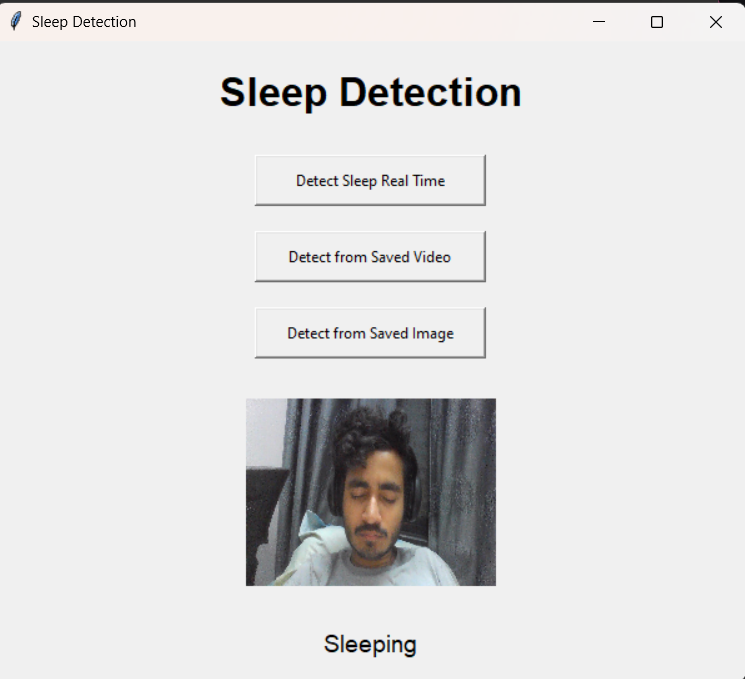
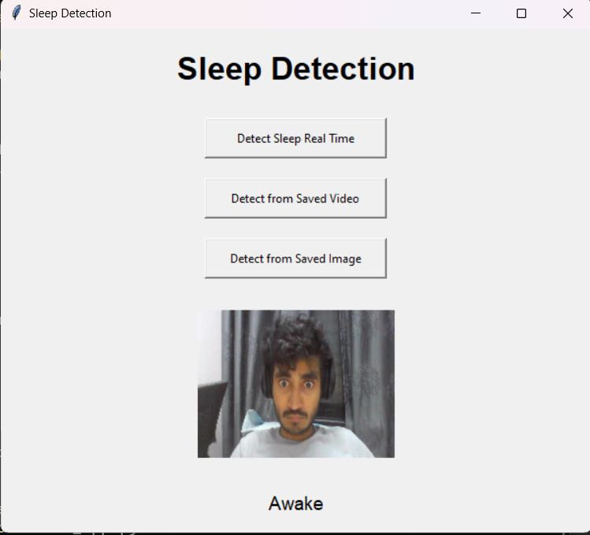

# Sleep Detection System with Dlib and OpenCV

This project implements a **real-time sleep detection system** using Dlib's facial landmark detection and OpenCV for image processing. The system identifies whether a person is present in the video feed and determines if the person is sleeping by calculating the **Eye Aspect Ratio (EAR)** from facial landmarks.

## 📌 Features

- **Human Presence Detection**: Detects the presence of a human face in real time.
- **Sleep Detection**: Uses Eye Aspect Ratio (EAR) to check if the person is sleeping based on their eye landmarks.
- **GUI Integration**: A user-friendly graphical interface that allows users to easily interact with the system.
- **Image and Video Support**: The system can now process both saved images and videos for sleep detection.

## 🚀 How It Works

1. **Face Detection**: The system uses Dlib's pre-trained face detector to find faces in the video feed.
2. **Landmark Detection**: It identifies key facial landmarks using a 68-point model.
3. **Eye Aspect Ratio (EAR)**: Calculates the EAR to detect whether the eyes are open or closed. If the EAR is consistently below a threshold, the system determines that the person is likely asleep.
4. **Sleep Confirmation**: If the person's eyes remain closed for a certain number of consecutive frames, the system confirms that the person is sleeping.

## 🛠 Installation

1. **Clone the repository**:

   ```bash
   git clone https://github.com/DumboDhruvi/sleep-detection.git
Navigate to the project directory:

bash
Copy code
cd sleep-detection
Install the required dependencies:

bash
Copy code
pip install -r requirements.txt
Download the Dlib shape predictor model:

Download the shape_predictor_68_face_landmarks.dat.bz2.
Extract the shape_predictor_68_face_landmarks.dat file and place it in the project directory.
## 💻 Usage
To run the sleep detection system on video frames or images:

bash
Copy code
python main.py
Parameters
EYE_AR_THRESH: The threshold for determining closed eyes.
EYE_AR_CONSEC_FRAMES: Number of consecutive frames required to confirm sleep.
You can tweak these parameters in the code for better accuracy depending on your video input.

## 📋 Example
Here’s a sample of how the system works:

The program reads video frames or saved images, detects faces, and calculates EAR.
If the EAR is below the set threshold (EYE_AR_THRESH) for a certain number of frames, it identifies the person as asleep.
## 🖼️ Screenshots




## 📅 Future Work
We aim to improve the system with the following features:

Gaze Detection: Expand the system's capabilities to detect attention or focus based on eye gaze.
Summary Generation: Generate a comprehensive report at the end of a session summarizing the sleep detection statistics.
## 🤝 Contributors
Dhruv Kumar
Akshint Varma
